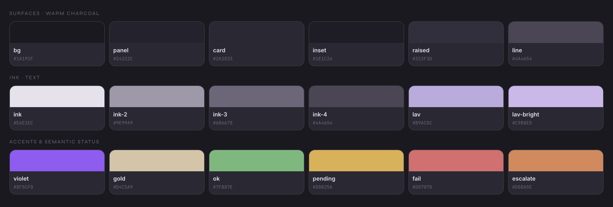
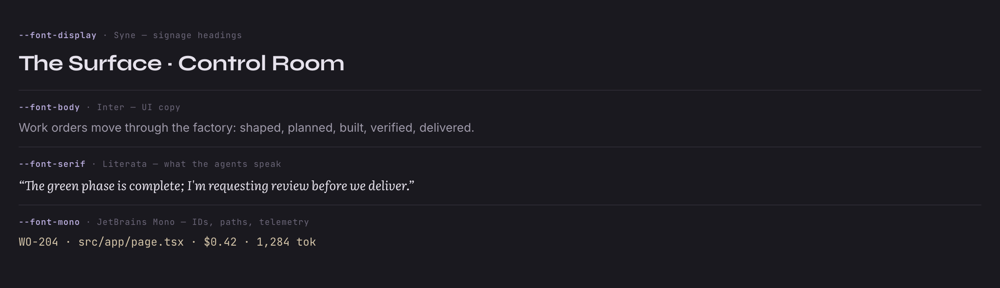
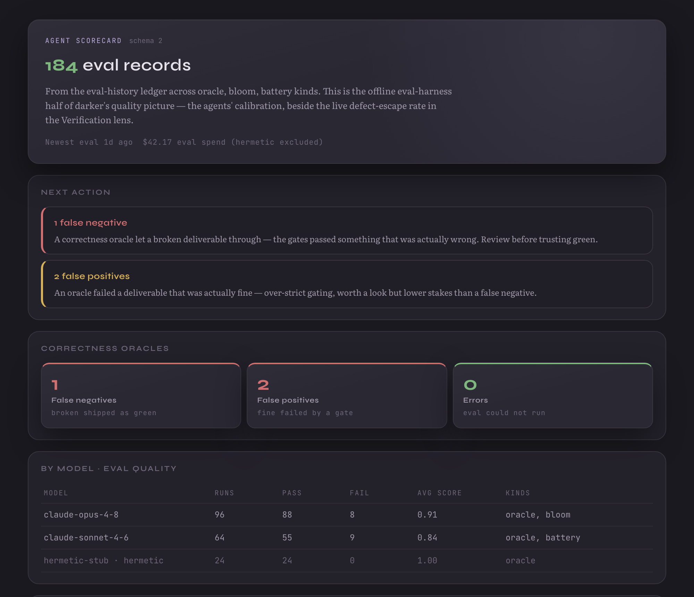

# Round-tripping a Next.js app into a Claude Design system

*How to sync an existing Next.js application — not a component library — into a
[Claude Design](https://claude.ai/design) design system: tokens first, then
components, with the layout the design system expects and a small tool to do it
again.*

---

## The setup

Claude Design lets you prompt an agent that builds real, working UI. Out of the
box it designs with generic components. The `/design-sync` skill changes that: it
imports *your* design system so every design the agent produces is on-brand and
maps onto code your engineers can ship.

If you built your interface in Claude Design and then implemented it for real,
you'll want to close the loop — sync the *implemented* system back so future
design work stays on-brand. Simple idea. One catch.

## The mismatch nobody warns you about

`/design-sync`'s converter expects a **component library**: a package that builds
a `dist/` of standalone components, or a Storybook. A typical Next.js app is
neither. It's an **application**:

- components are colocated route/view files under `src/app/`
- many import `next/navigation`, `fetch`, `/api/`, or `next/headers` — they don't
  render standalone
- styling is **CSS Modules** over a `var(--*)` token layer, not a Tailwind preset
  or a theme object
- there is no `dist/` — `next build` emits a server, not a component bundle

So the converter's happy path is out. But the **upload format is a contract**,
and the converter is only one way to produce it. You can produce it yourself.

## Decision 1: tokens first

The highest-fidelity, lowest-risk slice of any design system is its **tokens and
fonts**. They feed *every* rendered design. If yours already live in a single
global stylesheet (a palette as CSS custom properties) plus a few web fonts,
this part is quick.

The key constraint: **rendered designs receive only your `styles.css`'s
transitive `@import` closure.** So everything the look needs has to be reachable
from there:

```css
/* styles.css — the entry the design runtime consumes */
@import "./fonts/fonts.css";   /* web fonts via @import url(...) */
@import "./tokens/theme.css";  /* :root { --bg, --card, --accent, --radius-lg, ... } */
/* base resets + helpers below */
```

Copy your `:root` custom properties verbatim. Then write a **conventions doc** —
it gets inlined into the design agent's prompt. The lesson there: *name real
things.* "Follow the design system" is useless to an agent; a table of actual
token names (`var(--card)`, `var(--font-serif)`, `--shadow-card`) is something it
can act on. Validate every name against the built stylesheet before shipping — a
conventions file that names tokens which don't resolve is worse than none.

Here's a token system rendered straight from the synced `styles.css` — surfaces,
ink, accents, and semantic status:



…and the type roles, each a real web font loaded through the same closure:



Publish the design system and select it in your canvas, and the agent designs
on-brand. For many teams, **this is the whole job.** (One gotcha: a design system
must be *published* before it shows up in a canvas's picker.)

## Decision 2: do components actually work?

Tokens are the easy 80%. Components are the question. Triage them first — only
client-renderable, prop-driven components qualify:

| Bucket | Sync relevance |
|---|---|
| Route files (`page.tsx`/`layout.tsx`) | not components — auth + data loading |
| View components that fetch `/api/` internally | need data lifted to props first |
| **Client + prop-driven + no internal fetch** | **the clean extraction set** |

The clean set ports cleanly; the fetch-internally set needs a refactor (lift data
to props) before it can render standalone. De-risk with **one** component before
committing to a fleet.

## The harness

Pick a component that exercises every concern at once — a Next import, a
shared-lib import, a CSS Module, and a typed prop. The whole build is one esbuild
command:

```bash
esbuild entry.jsx --bundle --format=iife --jsx=automatic \
  --tsconfig=<baseUrl+paths> \
  --alias:next/link=shims/next-link.jsx \
  --alias:next/navigation=shims/next-navigation.js
```

- your path aliases (`@/*`) resolve via a tiny tsconfig (esbuild needs an
  explicit `baseUrl`)
- `next/link` → a 6-line `<a>` shim; `next/navigation` → an inert router
- **CSS Modules just work** — esbuild scopes them and emits a sibling
  `_ds_bundle.css`. Those scoped rules still reference your tokens
  (`var(--panel)`), so component styles compose with the token layer
- React is provided the way the runtime provides it

Render it with a fixture and check it. Here's a real, data-dense application view
— rendered completely standalone from the bundle, faithful down to the serif body
copy, the toned status borders, and the dimmed fixture row:



The bundling was never the risk.

## The component layout

A design system reads components from a **per-component directory** — a source
file, a type contract, usage notes, and a static preview card:

```
components/<Group>/<Name>/
  <Name>.jsx        self-contained source (inline app-lib helpers; next/link → <a>)
  <Name>.d.ts       the type contract the agent codes against
  <Name>.prompt.md  usage notes the agent reads
  <Name>.html       static preview card; first line: <!-- @dsCard group="…" name="…" … -->
```

Three things worth knowing:

1. **The preview card is static HTML**, not a live render — a human-facing
   thumbnail. The live bundle is what the *agent* composes with.
2. **Component CSS must be in `styles.css`'s `@import` closure** — a card that
   links it directly proves nothing about real designs.
3. **The project re-indexes when you open it.** After uploading, open the project
   once; the component then appears under its group with its card, types, and
   usage notes.

## What it actually costs

The harness is a ~30-line script. The real cost is **per-component authoring**
that can't be automated: a self-contained `.jsx` (inline app-lib helpers, swap
Next imports), real `.d.ts` types, the usage prose, a preview card, and a
fixture. For data-fetching views, add a refactor to lift data to props. That's
the real budget — not the bundling.

## The tool

[`ds-component-kit`](./ds-component-kit/) generalizes the harness: a config-driven
CLI that does the deterministic parts (build the bundle, shim Next, resolve
aliases, scaffold the component directory with the CSS-module class map
pre-extracted) and leaves clearly-marked `TODO(human/AI)` stubs for the parts
that need judgment. The [tutorial](./TUTORIAL.md) walks it end to end.

## Takeaways if you have a similar stack

- **Sync tokens first.** Most of the value, high-fidelity, fast. Components are a
  separate, larger project.
- **The upload format is the contract, not the converter.** An app can produce it.
- **Components live in `components/<Group>/<Name>/` directories**; the `.html`'s
  `@dsCard` line is the card; the project re-indexes on open.
- **Bundling is easy; data-decoupling is the work.** Presentational components
  port cleanly; data-fetching views need a refactor first.
- **Name real things in your conventions** — agents act on specifics, not vibes —
  and validate every name against the build.

---

*Screenshots are of a real Next.js app's "Dusk" theme, rendered through the
synced design layer.*
